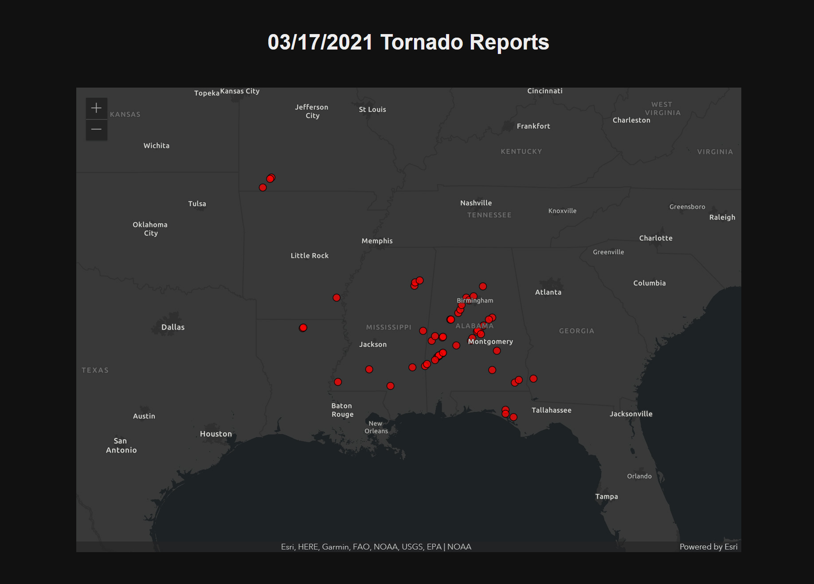
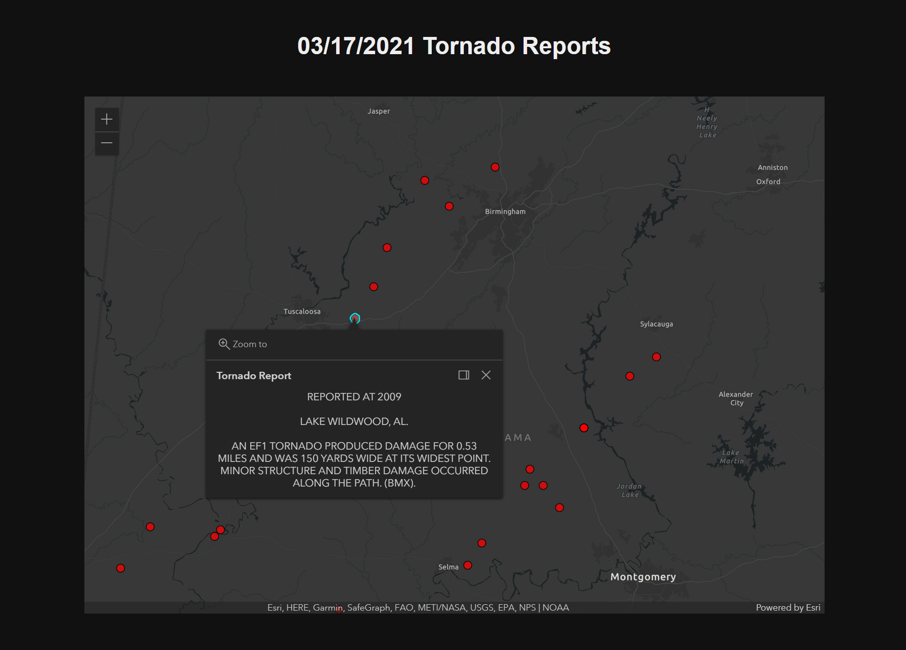

## CSV Layer example combining the ArcGIS JavaScript API with tabular data from NOAA.

## Sources

- [ArcGIS API](https://developers.arcgis.com/javascript/latest/)
- [NOAA](https://www.spc.noaa.gov/climo/reports/210317_rpts.html)

## Further Reading

[Working with the ArcGIS JavaScript API](https://medium.com/@ben.iburg/working-with-the-arcgis-javascript-api-111c7f0bcafe)